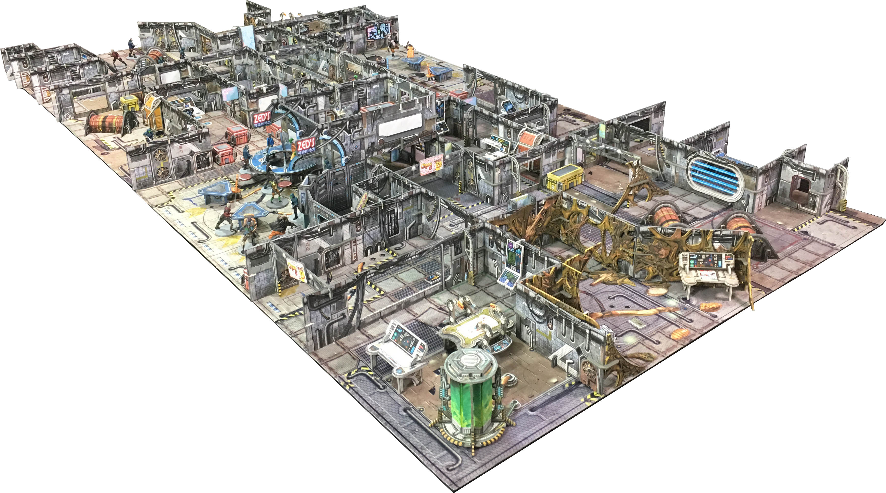

number: 003
title: The Titan Accord
url: https://battlesystems.co.uk/blog/mission-monday-03-the-titan-accord/
date: 2019-05-06

---

This week’s download is here by popular demand. The Titan Accord was a mission created during our Kickstarter to incorporate all of the various stretch goals and add-ons included within the pledge. It now serves as a prequel mission to the soon-to-be-released Purge: Outbreak expansion, detailing the start of the outbreak.

The mission makes use of the terrain and miniatures from the Shootout at Zed’s and Purge: Outbreak expansions, as well as the Galactic Corps miniatures included within the pledge. All of these products will be released at retail later in 2019, but non-backers can still play this mission in the meantime! As with all Core Space games there is room for customisation, so as long as you’ve got a second set of Battle Systems terrain to make a larger gaming area you can tweak the map to suit your collection and swap out any miniatures you don’t yet have for similar ones that you do.
