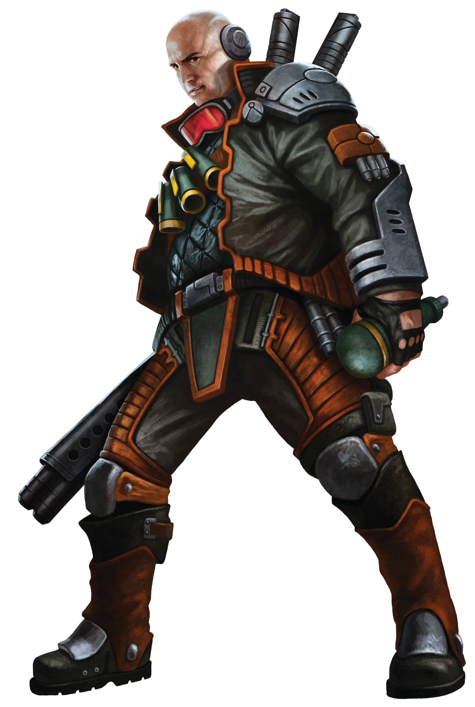

number: 004
title: The Lost Action Hero
url: https://battlesystems.co.uk/blog/mission-monday-04-the-lost-action-hero
date: 2019-05-20

---

Last week saw the official release of the Poseidon Crew, led by Captain Oberon Teelac.

In this mission he finds himself drifting through space looking for a job that will bring him the approval he craves. And then one falls into his lap!

Theta Station is under attack by the Purge and he’s the only one close enough to save its inhabitants. The more people he can save with his thrilling heroics, the more people can go on to tell his story as the Hero of Theta!
