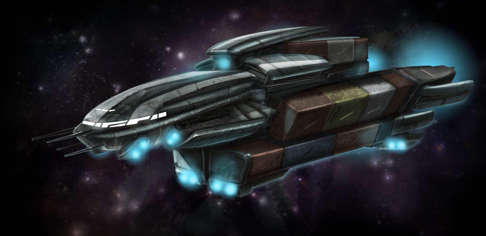

number: 008
title: Rescue on Daedalus
url: https://battlesystems.co.uk/blog/mission-monday-08-rescue-on-daedalus/
date: 2019-08-19

---

This week’s mission is inspired by a short story written back in 2017 during the Core Space Kickstarter. The story is available for download at https://www.dropbox.com/s/u8appesnsfj8pxa/Short%20Story%20-%20Rescue%20on%20Daedalus.pdf?dl=0.

This mission is playable with just the Starter Set, but is designed with some of the advanced rules in mind. The mission is best played with a Game Master (GM) who can shape the narrative and reveal hidden information to the other players during the game. If you intend to play the mission in this way and you are not the one running the game, do not read the mission download – give it to your GM so they can keep things secret.

By using a GM, Core Space can be played as a light RPG. Instead of controlling a crew themselves, the GM will instead be in charge of all the game’s decisions in order to build a narrative for the other players. The GM reads out the mission briefings, oversees any trades or disputes between players and generally manages the game. Instead of using the game’s AI, the GM will also take control of all the game’s NPCs, including the Purge!

For more on using a GM, check out the Deluxe Rulebook. You won’t need it to play this mission, but we recommend it anyway!

In this mission, the Traders have been hired to board the Daedalus, a derelict space ship, and find a data-chip left on board. When they arrive they find that the chip’s owner, a diplomat named Butler, is still alive, and they take advantage of the chance to rescue him and reap the rewards!
