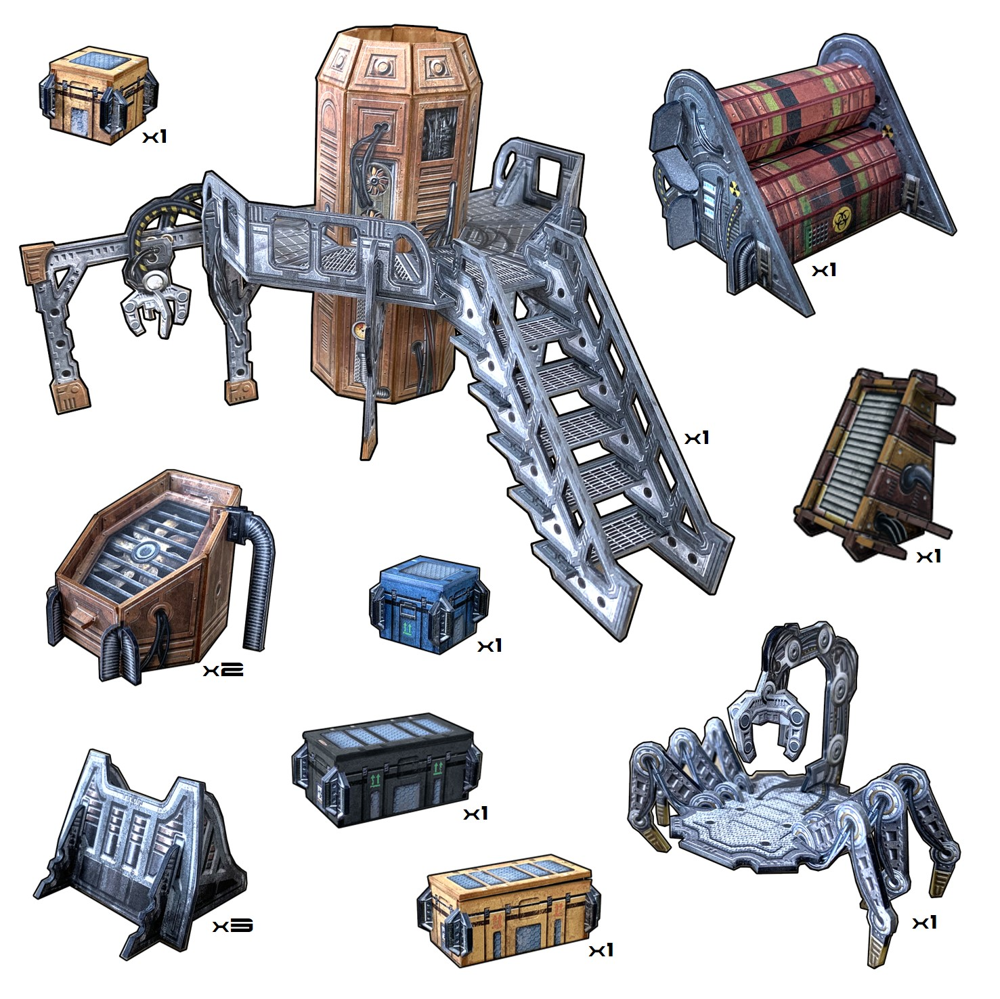

number: 009
title: Power Outage
url: https://battlesystems.co.uk/blog/mission-monday-09-power-outage/
date: 2019-09-09

---

We recently relaunched our sci-fi terrain range, and we added some brand new kits including the Engineering Sector:

This set is a perfect centrepiece for themed missions in an industrial area or the inner workings of a space station. Today’s new mission does just that.

To play this mission you will need the Core Space Starter Set and the Engineering Sector terrain pack.

The terrain is fully interactive – this mission involves the Traders taking control of the cargo-bot shown above to repair the damaged engine core of a space station by retrieving parts from industrial equipment scattered around the board. Of course it won’t be that simple – the Purge will be bearing down on you from the start!

If you have the Deluxe Rulebook you can take advantage of some of the advanced rules as well. The Engineering Sector is a two-storey kit, so your Traders can jump (or fall) off of the gantry, and use the upper level as a great vantage point for shooting.
