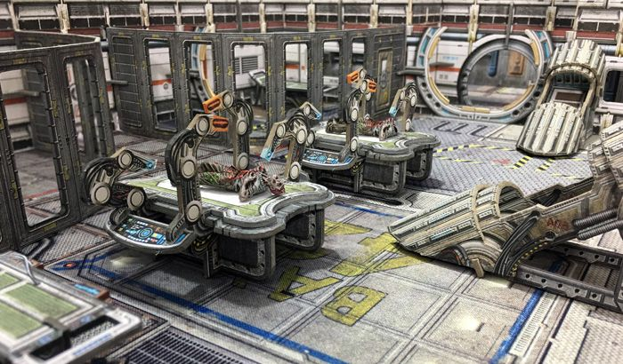

number: 012
title: Role Reversal
url: https://battlesystems.co.uk/blog/mission-monday-12-role-reversal/
date: 2019-12-23

---

This latest mission is an example of where we took some models and terrain sets as inspiration, built a story around them, and added special rules to turn that narrative into a mission. Core Space is the perfect sandbox to turn any story into a playable game!

In this case, I wanted to use one of my favourite terrain sets, the Medical Research Lab, and also to get more use out of the new Galactic Corps expansion for Core Space. Of course the Purge are an integral part of most Core Space missions and therefore needed to be included, but as for who was operating on who, I turned that on its head.

I also took inspiration from some of the new rules being added in a new Core Space expansion coming in 2020, so they are hinted at here…

To complete this mission, you will need to infiltrate a Purge base and rescue a Galactic Corps director who has been inexplicably abducted by the Purge. To mix it up a bit, I added a mechanic where the Purge start the game on patrol and the Traders can avoid conflict by being stealthy early on. I translated this to the map by making sure there was a route that the Traders could take with minimal chance of Purge contact. This was balanced by the fact that the significant valuables available on this map aren’t on that route, and you will be very close to the Mother if she wakes up! The mission should be fairly easy early on, but all the Purge that arrive will surround the objective, so you need to be quick to rescue the prisoners before there are too many of them!

To play this mission you will need the Purge: Outbreak Expansion, a Medical Research Lab, and a Purge Reinforcements Booster. You won’t need the Galactic Corps Expansion to play this mission, but you will need it after the game, so this mission could be a good way to build up to adding them into your games.
