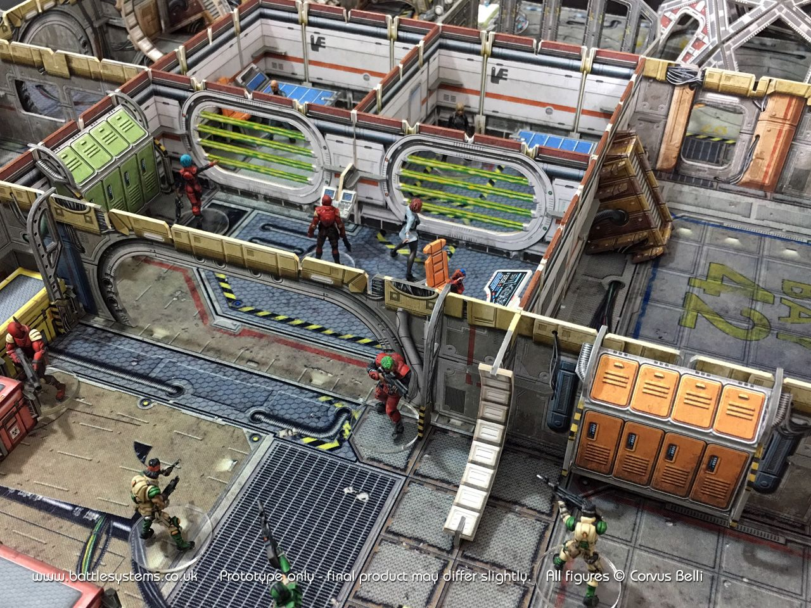

number: 013
title: Prison Break
url: https://battlesystems.co.uk/blog/mission-monday-13-prison-break/
date: 2020-01-20

---

The 13th mission – unlucky for some, and in this case it’s one of your Traders that has been apprehended by the Galactic Corps. This mission is perfect for inserting into a campaign after one of your Traders has been arrested.

This mission is also special because it started out as part of last year’s mission design competition. Core Space players around the world submitted their own custom missions and this year they will get to see their ideas in print. Yes, that’s right, all of the Monday Missions so far will soon be collated and published in a brand-new expansion book along with a new narrative campaign and lots of other exciting content. Make sure you are signed up to our newsletter to get the latest on our new Core Space products when they are released.

This mission was inspired by an idea from Ben Chapple. Thanks Ben. If anyone else has a mission they would like to see featured here, send it in to customerservice@battlesystems.co.uk – we look forward to hearing from you!

In this mission you will have to break into a Galactic Prison to liberate your crewmate, but it won’t be easy. You’ll need to team up with other crews and all sorts of criminal scum if you want to make it out alive!

This one was written for the many Core Space superfans out there who have everything – to play it as shown you will need the three main expansions, a set of Detention Cells, and some extra clips. However, like all Core Space missions it’s flexible – if you don’t have the exact components you can switch things out to match your collection :-).
