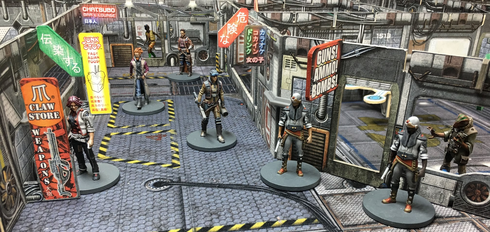

number: 014
title: Shopping Spree
url: https://battlesystems.co.uk/blog/mission-monday-14-shopping-spree/
date: 2020-02-17

---

This week’s mission adds a twist to the campaign phases of the game. Instead of the Trade Phase after the game where you can buy and sell items, this mission IS the Trade Phase! One of your contacts has given you a shopping list, and you’ll need to grab everything and get it back to them for a priceless reward. Of course, it’s up to you whether you decide to pay for the items or not, as long as you can deal with the mall security!

This mission was inspired by an idea from Mark Dekker. Thanks Mark. If anyone else has a mission they would like to see featured here, send it in to customerservice@battlesystems.co.uk – we look forward to hearing from you! This mission and more will soon be collated and published in a brand-new expansion book along with a new narrative campaign and lots of other exciting content. Make sure you are signed up to our newsletter to get the latest on our new Core Space products when they are released.
