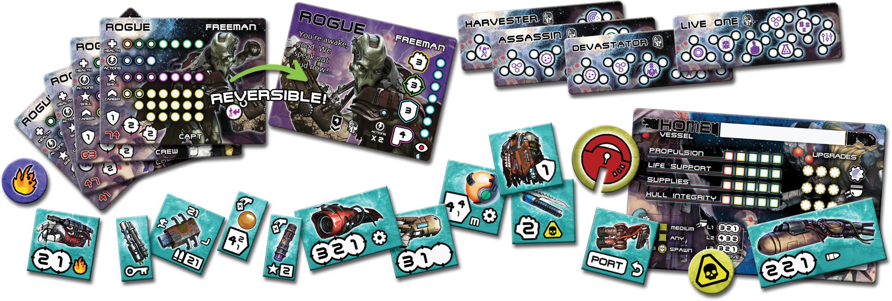

number: 016
title: The Secret of Sector 14
url: https://battlesystems.co.uk/blog/mission-monday-16-the-secret-of-sector-14/
date: 2020-05-04

---

We thought we’d tease you a little bit this time. Next week we will start shipping three new Core Space products – the Dangerous Days book and the Shift Change and Rogue Purge expansions. This week’s Monday Mission focuses on the Rogue Purge. Your task is to break into a high security prison and rescue a crimelord, but he’s not the only one behind bars… To break him out you’ll need to get past the ‘experiments’ roaming the board, but if you’re lucky you may be able to grab some unique Purge tech on your escape!

This mission was based on a submission from Guy Carmichael. Thanks Guy! If anyone else has a mission they would like to see featured here, send it in to customerservice@battlesystems.co.uk – we look forward to hearing from you! This mission and more have been collated and published in the new Dangerous Days book along with a new narrative campaign and lots of other exciting content. You can pre-order the new products HERE.
