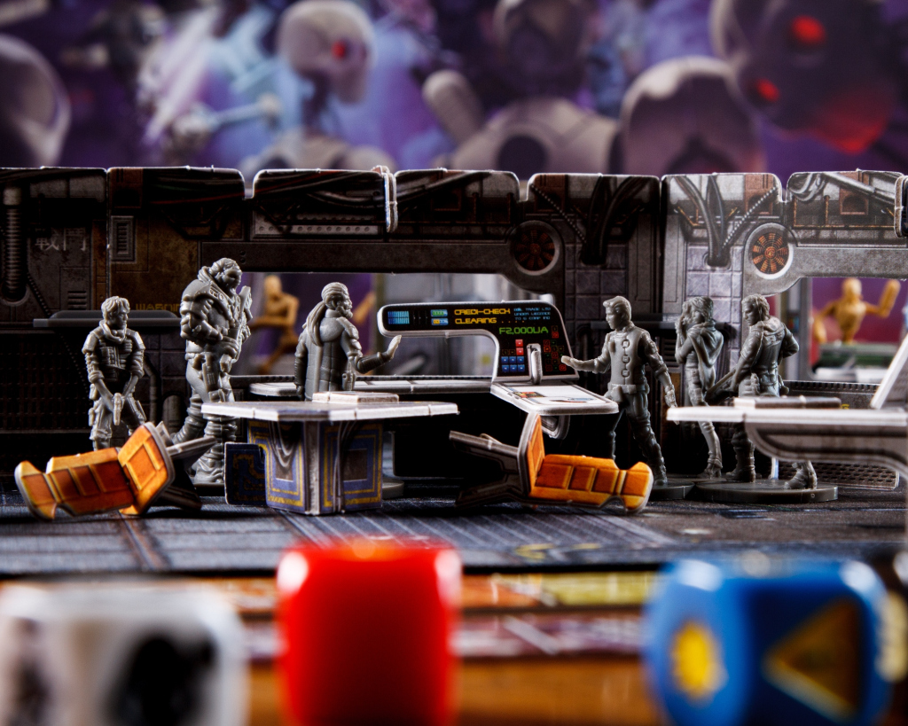

number: 020
title: Raid VR
url: https://battlesystems.co.uk/blog/mission-monday-20-raid-vr/
date: 2020-09-14

---

This week’s free download is the first from our newest member of staff Andrew (everyone say hi!), and is an idea he’s been working on for a while. Core Space can be all work and no play for our Traders and this is a chance for a break. It’s a one-off mission representing the latest VR fad – a video game called “Raid VR!” which pits two teams of users against each other in a race to steal their opponent’s objective and bring it back in capture-the-flag-style mayhem. Imagine it as something your Traders could be playing in an arcade while at a Trading Post.

It’s like a real mission but you can’t die! Your Traders will respawn at their starting point and carry on where they left off. At the end the highest score wins!

This mission requires only the Starter Set to play.
