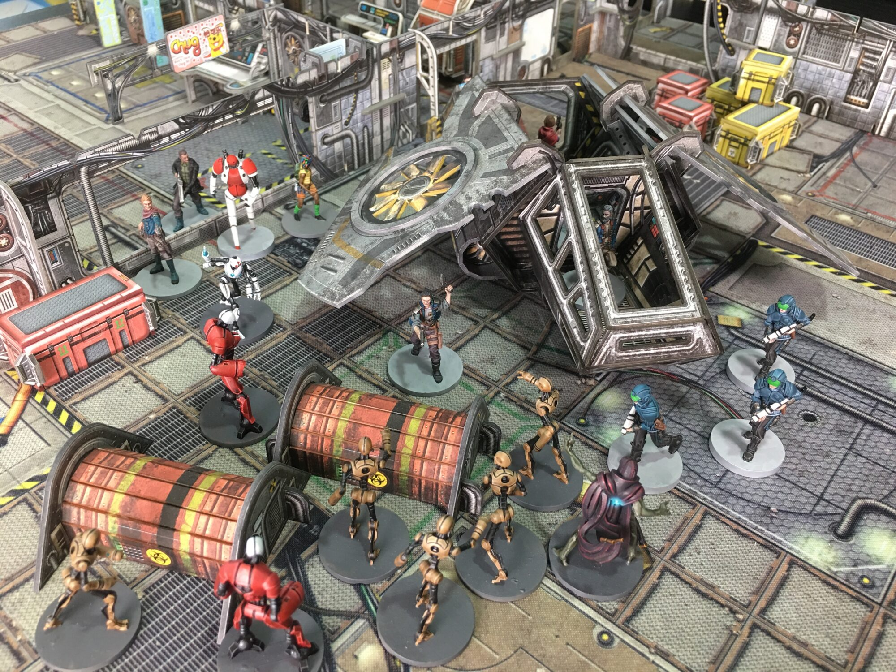

number: 025
title: Gone in 60 Parsecs
url: https://battlesystems.co.uk/blog/mission-monday-25-gone-in-sixty-parsecs/
date: 2021-03-01

---

This week’s free download takes inspiration from the latest season of the Expanse. It requires the Shift Change at MegaCorp expansion to play, and if you are successful you’ll earn yourself a Shuttle! If you’ve got an experienced crew, we recommend adding the Galactic Corps and the Gangers to the game too for more of a challenge. After all, you’re not going to be the only ones after this prize!

In this particularly affluent area of the Barrens – if you could believe such a place exists – a Purge attack has caused a hasty retreat by the residents, meaning plenty of valuable items have been left behind. Perhaps the most tempting prize is a shiny new Shuttle!

\* Yes, we know a parsec is a unit of distance, but we’re using some artistic licence to get away with a cool mission name!

